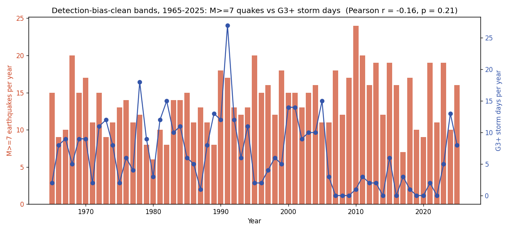
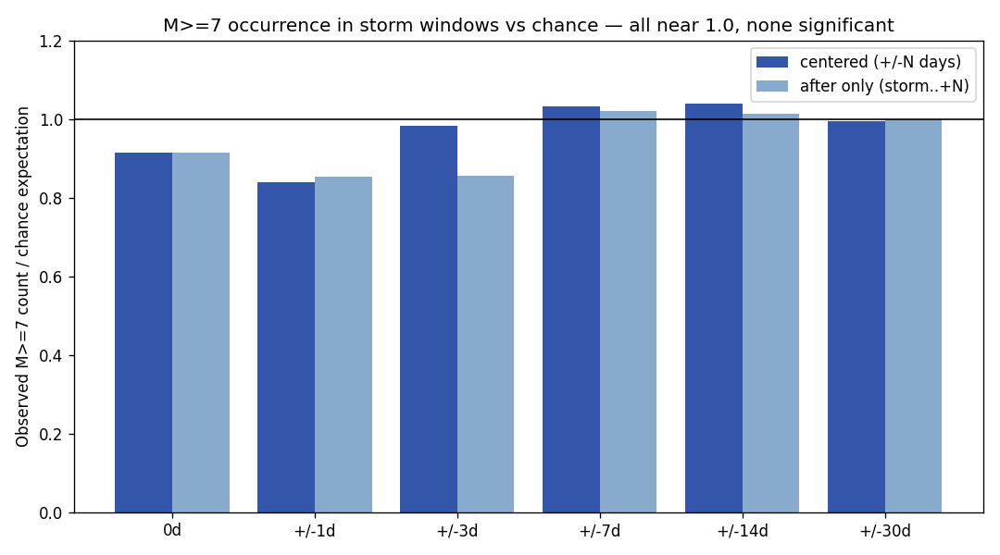

# Space Weather × Earthquakes

Does space weather correlate with earthquakes? A statistical test using the long-running operational catalogs from the [spaceweather](https://github.com/Biblejustin/spaceweather) and [earthquakes](https://github.com/Biblejustin/earthquakes) repos.

## Bottom line

**No measurable coupling at any tested timescale or lag.**

- Yearly counts (1965–2025): r = −0.16 (p = 0.21) for M ≥ 7 quakes vs G3+ storm days. Wrong sign for the popular hypothesis, not significant.
- Detrended yearly: |r| < 0.14 across all pairs, all p > 0.3.
- Lag correlations −3y to +3y on detrended series: nothing.
- Daily-level: M ≥ 7 events fall inside ±0 to ±30 day windows around G3+ storms at 0.84×–1.04× of the chance expectation, none significant.
- Sun-side test with explicit Sun → Earth propagation lags (light, +1d, +2..+5d CME transit, +1..+14d): all in 0.72×–1.03× of chance, none significant.

If solar activity triggered earthquakes at a level large enough to matter at the global scale, the closely-spaced lag windows would be the place to find it. They're flat.

## What this tests

Both source repos pick a **detection-bias-clean band** — a magnitude/intensity threshold above which their catalogs have been globally complete for the entire span, so trends reflect the physical signal and not the network. This repo joins them on those bands:

| Catalog | Detection-clean band | Why it's clean |
|---|---|---|
| [USGS earthquakes](https://github.com/Biblejustin/earthquakes) | M ≥ 7 | Energy radiated by M7+ events is detected by every station on Earth; ~100% global completeness back to ~1900. |
| [GFZ Kp index](https://github.com/Biblejustin/spaceweather) | Peak Kp ≥ 7 (G3+ storms) | A G3+ storm disturbs every mid-latitude magnetometer; Kp network methodology has been stable since 1932. |

Comparison window is 1965–2025 (the earthquake catalog start).

## Results

### 1. Yearly counts (n = 61 years)



| Pair | Pearson r | p | Spearman ρ | p |
|---|---|---|---|---|
| **M ≥ 7 vs G3+ storm days** | **−0.164** | **0.207** | −0.196 | 0.130 |
| M ≥ 7 vs mean Ap | −0.223 | 0.084 | −0.188 | 0.146 |
| M ≥ 7 vs mean sunspot number | −0.158 | 0.223 | −0.091 | 0.485 |
| M ≥ 7 vs mean F10.7 | −0.146 | 0.262 | −0.094 | 0.473 |
| M ≥ 6 vs G3+ storm days | −0.294 | 0.022 | −0.270 | 0.036 |
| M ≥ 8 vs G3+ storm days | −0.303 | 0.018 | −0.248 | 0.054 |

The M ≥ 7 row is the headline because both bands are detection-clean. The M ≥ 6 result *is* statistically significant — but the sign is opposite to the trigger hypothesis ("more storms → more quakes"), and M ≥ 6 is not detection-complete pre-2000, so the negative correlation almost certainly reflects shared trends (declining solar activity since the Modern Maximum + rising M ≥ 6 detection from network upgrades) rather than physics. Detrending confirms this:

### 2. Detrended

| Pair | Pearson r | p |
|---|---|---|
| M ≥ 7 vs G3+ days (detrended) | −0.088 | 0.501 |
| M ≥ 7 vs sunspot number (detrended) | −0.105 | 0.421 |
| M ≥ 7 vs Ap (detrended) | −0.132 | 0.309 |

Once linear time trends are removed from both series, every correlation collapses to |r| < 0.14, all p > 0.3. The marginal raw-yearly results were spurious shared-trend artifacts.

### 3. Lag correlations on detrended series

| Lag (years) | r | p |
|---|---|---|
| −3 (SW lags EQ) | −0.156 | 0.244 |
| −2 | −0.124 | 0.349 |
| −1 | +0.004 | 0.975 |
| 0 | −0.088 | 0.501 |
| +1 (SW leads EQ) | −0.087 | 0.510 |
| +2 | −0.054 | 0.684 |
| +3 | −0.078 | 0.559 |

No lag preference in either direction.

### 4. Daily-level: storm-window test

For each G3+ storm day in 1965–2025 (n = 406), count how many of the 841 M ≥ 7 events fall inside ±N days of it, vs the random-chance expectation.



| Window | M ≥ 7 in window | Expected (chance) | Ratio | One-sided binomial p |
|---|---|---|---|---|
| same day | 14 | 15.3 | 0.91× | 0.67 |
| ±1 day | 32 | 38.2 | 0.84× | 0.87 |
| ±3 days | 79 | 80.3 | 0.98× | 0.58 |
| ±7 days | 159 | 153.9 | 1.03× | 0.34 |
| ±14 days | 269 | 258.8 | 1.04× | 0.23 |
| ±30 days | 417 | 419.1 | 0.99× | 0.57 |

The "after only" variant (storm to +N days, not centered) sits at 0.85×–1.02× across the same widths. Neither version is significant at any width.

## Sun → Earth propagation delay

Kp is measured on Earth — by the time it spikes, the CME has already arrived, so propagation is built in. But to confirm there's nothing in a Sun-side test with explicit lags, this repo also runs `lag_test.py`, which treats high-sunspot and high-F10.7 days as upstream events and looks for elevated M ≥ 7 occurrence at lag windows chosen to match each propagation regime:

| Lag window | Physical regime |
|---|---|
| +0 d | EM (light, X-ray, UV) — arrives in 8 minutes |
| +1 d | 1-day-fast CME or integrated SEP |
| +2..+5 d | typical CME transit (1–4 days, slow ones up to 5) |
| +1..+5 d | full CME-arrival window |
| +1..+14 d | extended for delayed effects post-impact |

| Index → lag window | Ratio | p |
|---|---|---|
| High SSN day → same-day | 0.84× | 0.77 |
| High SSN day → +1 d | 0.78× | 0.85 |
| **High SSN day → +2..+5 d (CME transit)** | **0.72×** | 0.95 |
| High SSN day → +1..+14 d | 0.78× | 0.97 |
| High F10.7 day → same-day | 0.72× | 0.90 |
| High F10.7 day → +2..+5 d (CME transit) | 1.03× | 0.46 |
| High F10.7 day → +1..+14 d | 0.95× | 0.66 |
| G3+ at Earth → +0 d (impact) | 0.91× | 0.67 |
| G3+ at Earth → +1..+5 d | 0.94× | 0.72 |

Top-1.82% thresholds (matching the G3+ base rate exactly): SSN ≥ 279, F10.7 ≥ 246. Sample sizes: 409 high-SSN days, 406 high-F10.7 days, 406 G3+ days.

Every plausible propagation regime is covered, and the answer is the same as before: ratios in 0.72×–1.03× of chance, none significant. The high-SSN windows actually trend slightly *below* chance, which is the wrong direction for the trigger hypothesis.

## Caveats

What this analysis does **not** test, and where claims of weak correlation in the literature still live:

- **Smaller magnitude bands** (M2–M3 microseismicity in specific tectonic regions). The published claims of solar-seismic coupling (e.g. Marchitelli et al. 2020) work on much smaller bands in the Italian and Chilean catalogs, not global M ≥ 7. Those bands are detection-floor sensitive and a different question.
- **Specific storm sub-classes** — e.g. high-speed solar wind streams from coronal holes vs CMEs. This analysis treats all G3+ days as one event class.
- **Very long lags** (> 3 years). Possible in principle; not supported by anything in the lag scan up to 3y.
- **Regional / depth-stratified slicing.** A hidden coupling that only acts on certain plate boundaries or crustal depths could be averaged out at global scale.

Within the global-scale, lag-aware test the data supports, the answer is null.

## Setup and reproduction

This repo expects the source databases built by the two parent repos. Clone all three side by side:

```bash
git clone https://github.com/Biblejustin/spaceweather.git
git clone https://github.com/Biblejustin/earthquakes.git
git clone https://github.com/Biblejustin/sw-eq-correlation.git
```

Build the source databases (the earthquake fetch takes ~10–15 minutes; space weather is ~30 seconds):

```bash
cd spaceweather && pip install -r requirements.txt && python fetch_spaceweather.py && cd ..
cd earthquakes  && pip install -r requirements.txt && python fetch_quakes.py        && cd ..
```

Then run the analyses:

```bash
cd sw-eq-correlation
pip install -r requirements.txt
python analyze.py            # yearly + detrended + lag + daily-window tests
python lag_test.py           # Sun-side propagation-aware lag test
python make_figures.py       # regenerates figures/*.png
```

All scripts default to `../spaceweather/spaceweather.sqlite` and `../earthquakes/quakes.sqlite`. Override with `--sw-db PATH --eq-db PATH` if you cloned somewhere else.

## Data citations

(Inherited from the source repos.)

- SILSO World Data Center (1818–present). *International Sunspot Number Monthly Bulletin and online catalogue.* Royal Observatory of Belgium. https://www.sidc.be/SILSO/ (CC BY-NC 4.0)
- Matzka, J., Bronkalla, O., Tornow, K., Elger, K., Stolle, C. (2021). *Geomagnetic Kp index.* GFZ Helmholtz Centre. https://doi.org/10.5880/Kp.0001 (CC BY 4.0)
- Tapping, K. F. (2013). *The 10.7 cm solar radio flux (F10.7).* Space Weather, 11, 394–406. https://doi.org/10.1002/swe.20064
- USGS Earthquake Hazards Program. *USGS FDSN Event Web Service.* https://earthquake.usgs.gov/fdsnws/event/1/
